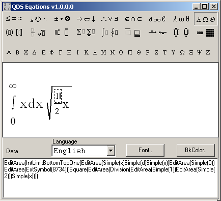

QDSEquations
============

Delphi component equation editor that allow you to enter and display math formulas of any complexity, from simple Greek symbols to matrixes and complex integral expressions. 
You can use the equation editor in your projects written in the Delphi environment, for example, in programs testing knowledge of different mathematics fields (mathematical analysis, discrete mathematics, probability theory and so on), physics and other.

It’s quite easy to enter formulas in it:
* simple symbols are entered similarly to entering data in a text field
*	special symbols and formula elements are entered with the help of an additional menu

## How to compile resources

- If you have Delphi installed (brcc32) just run `cmpres.cmd` in resources folder.
- For Lazarus run `cmpres_windres.cmd`. In requires `windres` which can be obtained by [installing MinGW](https://sourceforge.net/projects/mingw-w64/) and selecting `mingw32-base`.

Contributions Welcome!
